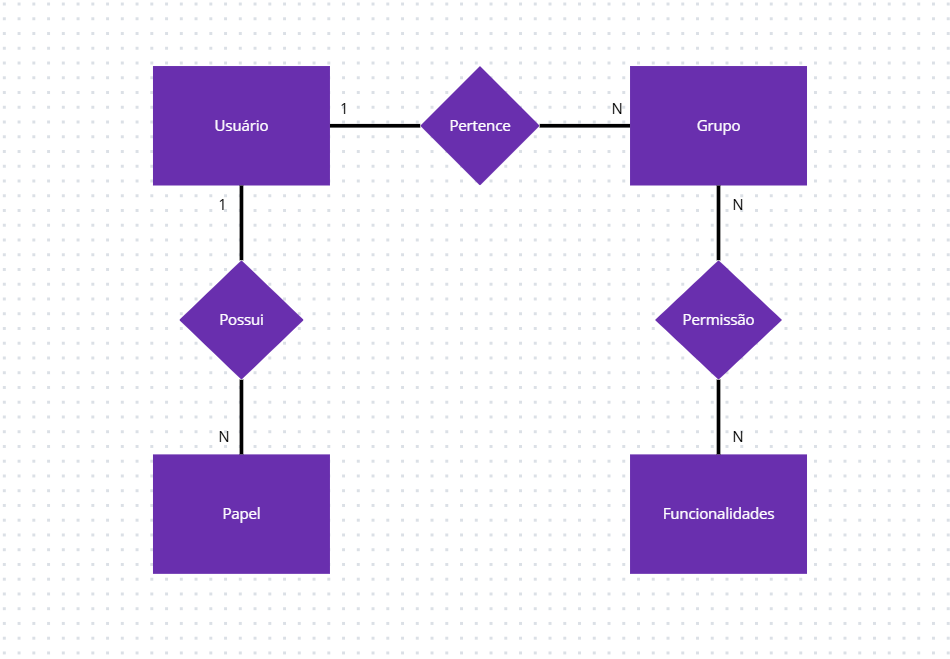

# AV-N1

1) 

# Atributos Negociais por Entidade

## Usuário (User)
- Nome
- Sobrenome
- E-mail corporativo
- Último acesso
- Status ativo/inativo
- Data de criação
- Data de modificação

## Grupo (Group)
- Nome do grupo
- Descrição (opcional)
- Status ativo/inativo
- Data de criação
- Data de modificação

## Permissão (Permission)
- Funcionalidade vinculada
- Grupo associado
- Status ativo/inativo
- Data de criação
- Data de modificação

## Papel (Role)
- Nome do papel
- Descrição (opcional)
- Status ativo/inativo
- Data de criação
- Data de modificação

## Módulo (Module)
- Chave identificadora do módulo
- Status ativo/inativo
- Data de criação
- Data de modificação

## Funcionalidade de Módulo (Features_Modules)
- Nome da funcionalidade agrupada
- Referência ao módulo
- Status ativo/inativo
- Data de criação
- Data de modificação

## Funcionalidade (Features)
- Chave da funcionalidade (ex.: `CREATE_USER`)
- Funcionalidade do módulo associada
- Status ativo/inativo
- Data de criação
- Data de modificação

## Relacionamentos
- Usuário ↔ Grupo
- Usuário ↔ Papel
- Grupo ↔ Permissões ↔ Funcionalidades
